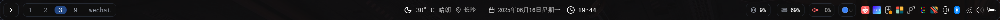
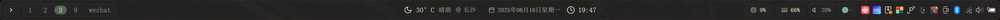
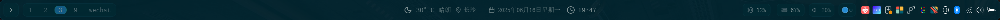
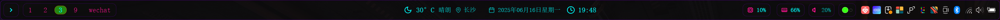
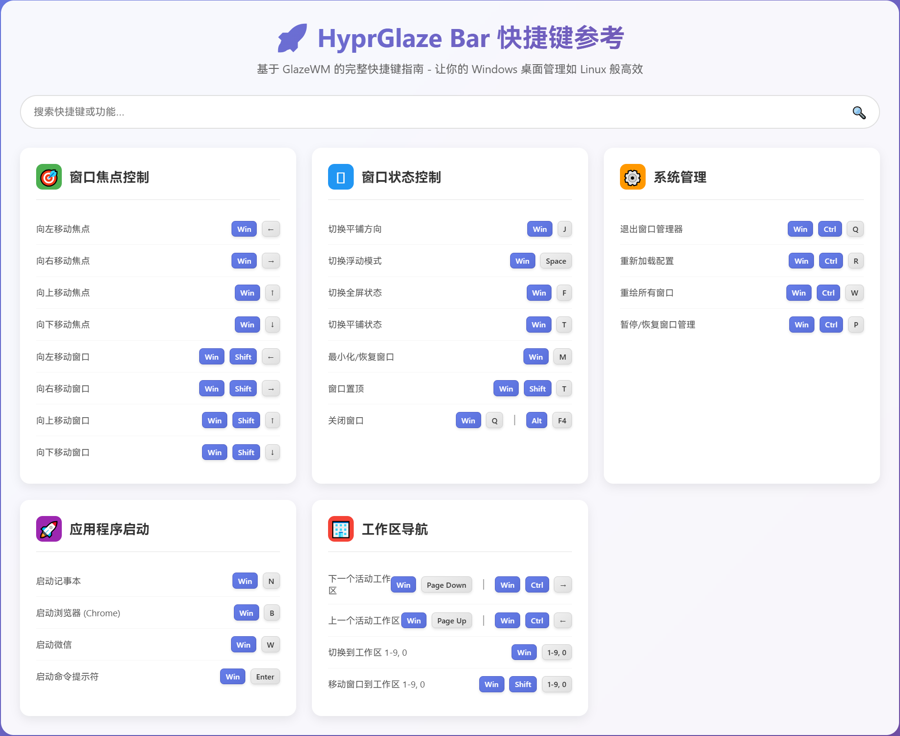

# HyprGlaze Bar

<div align="center">

**将 Hyprland 的优雅体验通过 GlazeWM 带到 Windows**

_现代化状态栏 - 基于 React + TypeScript 构建的高性能 Zebar 主题_

[快速开始](#-快速开始) • [功能特性](#-功能特性) • [安装指南](#-安装指南) • [使用说明](#-使用说明) • [快捷键参考](docs/shortcuts-reference.html)

</div>

---

## 🌟 项目概述

HyprGlaze Bar 是一个专为 Windows 平台设计的现代化状态栏，通过 GlazeWM 窗口管理器和 Zebar 状态栏框架，将 Linux Hyprland 的优雅平铺窗口体验完美移植到 Windows 系统。

> 💡 **想了解更多？** 查看 [项目推广页面](PROMOTION.md) 了解详细特性

## 📸 界面展示

<div align="center">









</div>

---

## ✨ 技术特性

### 🏗️ 架构设计

- **React 19 + TypeScript**: 现代化前端技术栈
- **Zebar 3.0+ 集成**: 基于最新状态栏框架
- **WebSocket 实时通信**: 与 GlazeWM 的高效数据交换
- **模块化组件**: 高度可维护的代码结构

### 📊 核心功能

- **平铺窗口管理**: 智能布局控制和工作区管理
- **系统监控**: CPU、内存、网络使用率实时显示
- **音量控制**: 可视化音量调节，支持滚轮操作
- **天气信息**: 基于地理位置的实时天气数据
- **系统托盘**: 完整的系统托盘图标集成

### 🎨 视觉设计

- **毛玻璃效果**: backdrop-filter 实现的现代化透明效果
- **流畅动画**: 基于 CSS transitions 的丝滑过渡
- **响应式布局**: 适配不同分辨率和 DPI 设置
- **主题系统**: 支持深色主题，可扩展更多主题

---

## 📦 安装指南

> 📖 **详细功能介绍**: 查看 [PROMOTION.md](PROMOTION.md) 了解完整特性说明

### 系统要求

- **Windows 10/11**
- **GlazeWM**: v3.0.0+ ([下载最新版本](https://github.com/glzr-io/glazewm/releases))
- **Zebar**: v3.0.0+ ([下载最新版本](https://github.com/glzr-io/zebar/releases)) ⚠️ **重要：必须手动升级到 3.0+版本**

### 安装步骤

```bash
# 1. 克隆项目
git clone https://github.com/AnkRoot/hyprglaze-bar.git
cd hyprglaze-bar

# 2. 复制配置文件
copy "glazewm\config.yaml" "%USERPROFILE%\.glzr\glazewm\config.yaml"
copy "zebar\settings.json" "%USERPROFILE%\.glzr\zebar\settings.json"

# 3. 复制主题文件
xcopy /E /I "zebar\hyprglaze-bar" "%USERPROFILE%\.glzr\zebar\hyprglaze-bar"

# 4. 重新加载 GlazeWM 配置
# Win + Ctrl + R 或重启 GlazeWM
```

---

## 🎮 使用说明

### 界面布局

<div align="center">


_现代化状态栏布局：平铺控制 | 工作区管理 | 天气时间 | 系统监控 | 音量控制 | 系统托盘_

</div>

### 快捷键操作

<div align="center">



</div>

### 状态栏操作

#### 🔊 音量控制

- **点击图标**: 切换静音/解除静音
- **点击百分比**: 展开音量滑块
- **滚轮调节**: 在音量区域滚动调节音量

### 常见问题

#### 状态栏不显示

```bash
# 检查进程并手动启动
tasklist | findstr zebar
zebar
```

#### 天气信息不显示

- 检查网络连接和地理定位权限
- 查看浏览器控制台错误信息

#### 工作区切换不工作

- 重新加载 GlazeWM 配置: `Win + Ctrl + R`
- 检查配置文件语法

### 更新项目

```bash
# 更新项目
git pull origin main
xcopy /E /I "zebar\hyprglaze-bar" "%USERPROFILE%\.glzr\zebar\hyprglaze-bar" /Y
```

---

## 🤝 贡献

欢迎提交 Issue 和 Pull Request！查看 [贡献指南](CONTRIBUTING.md) 了解详情。

## 📄 许可证

[MIT 许可证](LICENSE)

## 🙏 致谢

- [GlazeWM](https://github.com/glzr-io/glazewm) - Windows 平铺窗口管理器
- [Zebar](https://github.com/glzr-io/zebar) - 状态栏框架
- [Hyprland](https://hyprland.org/) - 设计灵感来源
